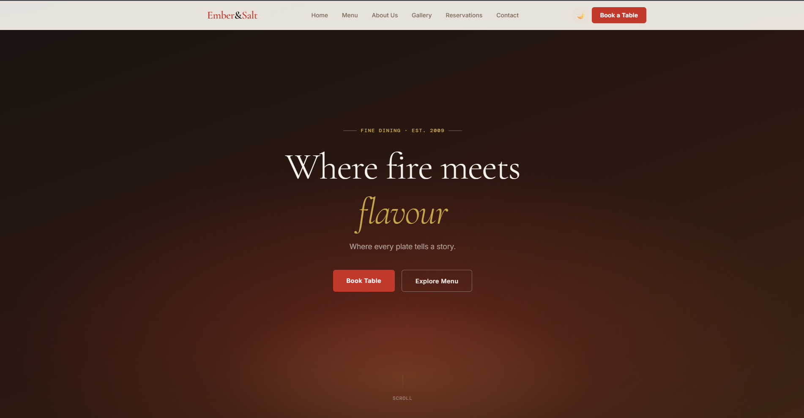
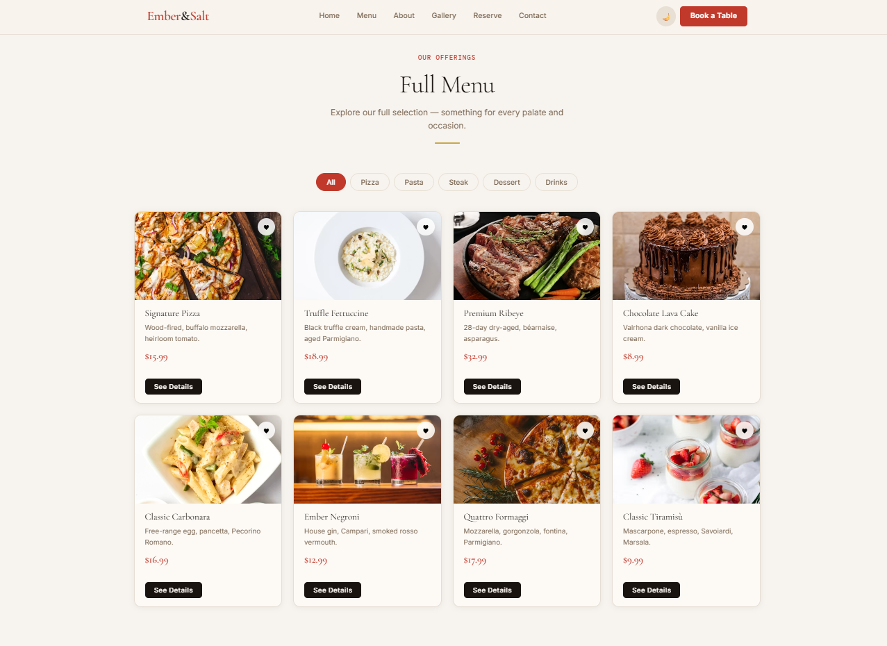
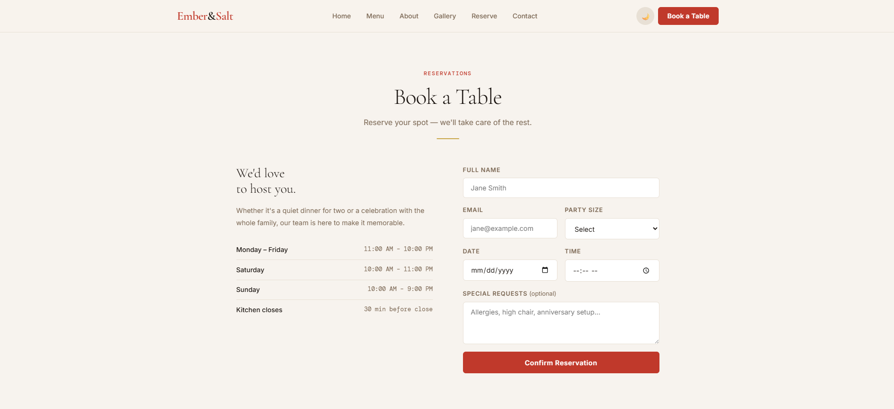

# 🍽️ Ember&Salt. - Restaurant Website

## 📖 Overview
Ember&Salt. is a modern, responsive web interface designed to showcase a premium dining experience. This project bridges the gap between culinary art and digital design, offering customers an effortless way to explore the menu, book a table, and learn about the chef's philosophy.

## ✨ Features
*   **Interactive Menu:** A cleanly structured menu displaying categories (Appetizers, Mains, Desserts, Drinks) with pricing and dietary tags (e.g., Vegan, Gluten-Free).
*   **Reservation System UI:** An intuitive, user-friendly booking form for customers to reserve tables by selecting dates, times, and guest counts.
*   **Chef's Story / About Us:** A dedicated narrative section highlighting the restaurant’s history, local sourcing ethos, and culinary team.
*   **Location & Hours Integration:** Easy-to-read operational hours and an integrated map interface for effortless navigation.
*   **Rich Media Gallery:** High-resolution showcases of signature dishes and the restaurant's interior ambiance.

## 💻 Technologies Used
*   **Frontend:** HTML5, CSS3 (Flexbox/Grid), Vanilla JavaScript
*   **Assets:** Optimized high-fidelity food photography and modern SVG iconography
*   **Architecture:** Clean, modular static file structure separating views (`index.html`, `menu.html`, `reservation.html`) and assets

## 🚀 Installation

Get a local instance of the restaurant website up and running in seconds:

1.  **Clone the repository:**
    ```bash
    git clone [https://github.com/Vince-Paolo/Restaurant-Website]
    ```
2.  **Navigate to the project directory:**
    ```bash
    cd Restaurant-Website
    ```
3.  **Launch the application:**
    Open `index.html` directly in your browser, or serve it using an extension like *Live Server* in VS Code for real-time updates.

## 🔮 Future Improvements
*   **Live Booking Engine:** Connect the frontend reservation form to a backend database (or service like OpenTable) for live availability.
*   **Online Ordering & Cart:** Build out a functional cart and checkout system for takeout and delivery orders.
*   **Interactive Menu Filtering:** Implement JavaScript filters so users can instantly sort dishes by price, popularity, or allergens.
*   **Admin Dashboard:** Add a secure backend panel for staff to update daily specials and manage incoming reservations.

## 📸 Screenshots

| Home Page | Interactive Menu | Reservation Form |
| :---: | :---: | :---: |
|  |  |  |

## 🔗 Links

*   **Live Demo:** [https://restaurant-website-zxa6.onrender.com/]
*   **GitHub Repository:** [(https://github.com/Vince-Paolo/Restaurant-Website)]

---
*Crafted with a passion for good food and seamless digital experiences.*
